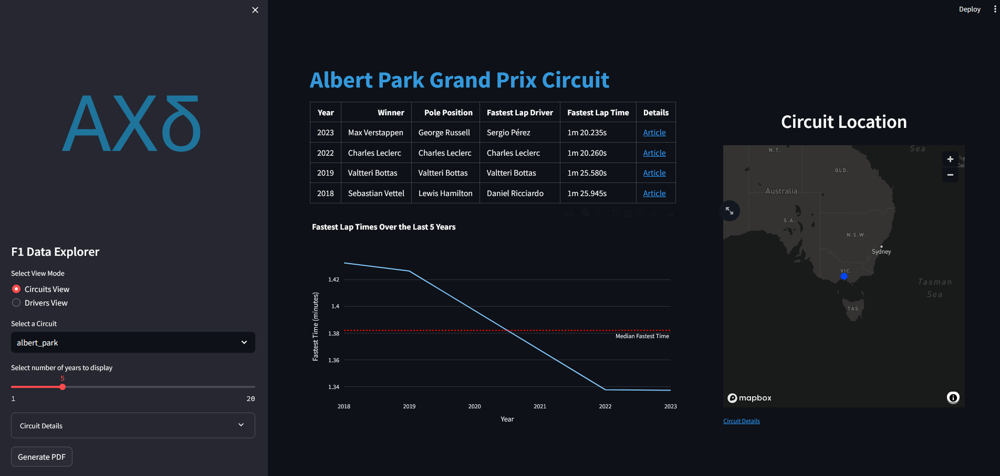
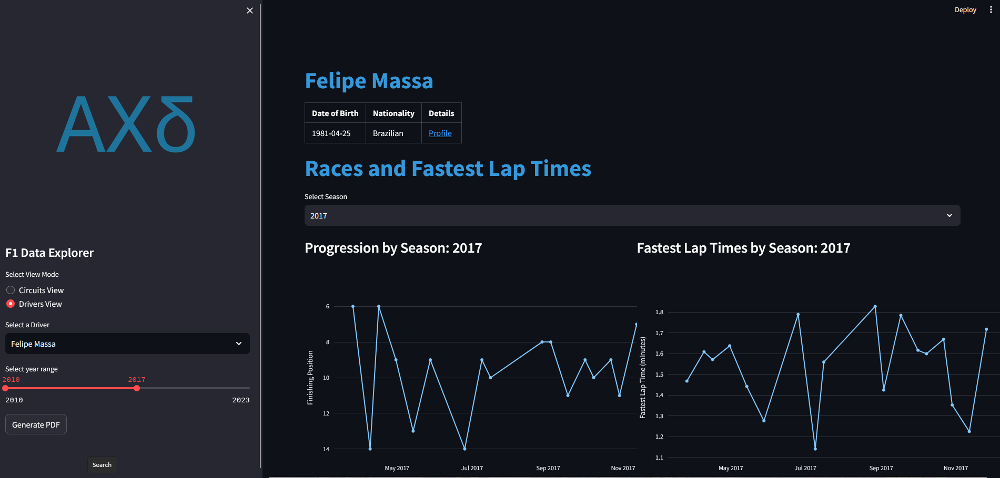

Instructions:
1. The complete codebase package should consist of 2 folders 

	a. dataset - containing the original provided dataset

	b. config - containing the formatting assets for the dashboard

	c. The main folder should have 5 files

		I. EDA.ipynb

		II. database_structuring.ipynb

		III. data_display_dashboard.py

		IV. f1_database.db

		V. requirements.txt

		VI. README.md
2. For a cold start the codebase is designed to be run in the order EDA.ipynb -> database_structuring.ipynb -> data_display_dashboard.py

3. Package requirements are listed in requirements.txt. The dashboard is built on streamlit v1.32.2 

